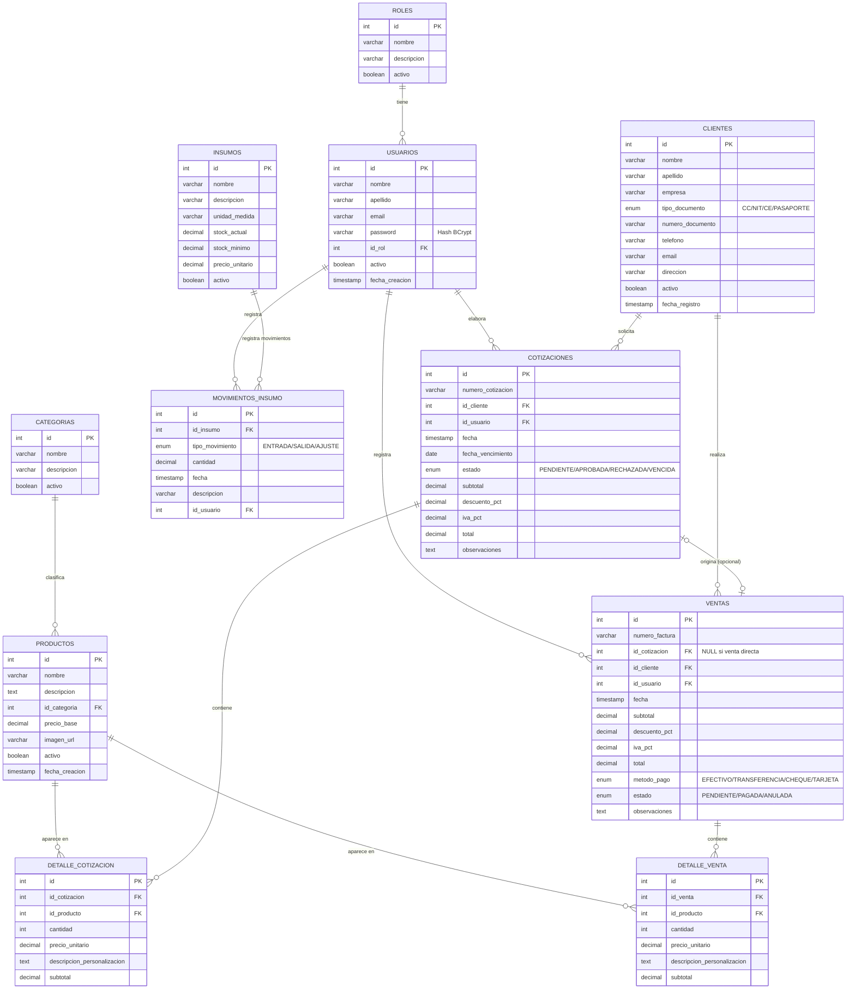

# Diagrama Entidad-Relación (DER)
### Base de Datos: creaciones_edimile

---

## Descripción del Diagrama

El diagrama muestra las **11 tablas** de la base de datos y sus relaciones.

---

## DER — Diagrama Mermaid (renderizable en GitHub, Notion, etc.)

> Para visualizarlo: pega el código en [https://mermaid.live](https://mermaid.live) o en cualquier visor Mermaid.

---

## Descripción de Relaciones

| Relación | Tipo | Descripción |
|----------|------|-------------|
| ROLES → USUARIOS | 1:N | Un rol puede asignarse a muchos usuarios |
| USUARIOS → COTIZACIONES | 1:N | Un usuario elabora muchas cotizaciones |
| USUARIOS → VENTAS | 1:N | Un usuario registra muchas ventas |
| USUARIOS → MOVIMIENTOS_INSUMO | 1:N | Un usuario registra muchos movimientos |
| CLIENTES → COTIZACIONES | 1:N | Un cliente puede tener muchas cotizaciones |
| CLIENTES → VENTAS | 1:N | Un cliente puede tener muchas ventas |
| CATEGORIAS → PRODUCTOS | 1:N | Una categoría agrupa muchos productos |
| COTIZACIONES → DETALLE_COTIZACION | 1:N | Una cotización tiene uno o más ítems |
| VENTAS → DETALLE_VENTA | 1:N | Una venta tiene uno o más ítems |
| COTIZACIONES → VENTAS | 1:0..1 | Una cotización aprobada puede originar una venta (opcional) |
| INSUMOS → MOVIMIENTOS_INSUMO | 1:N | Un insumo tiene muchos movimientos de stock |
| PRODUCTOS → DETALLE_COTIZACION | 1:N | Un producto aparece en muchos detalles de cotización |
| PRODUCTOS → DETALLE_VENTA | 1:N | Un producto aparece en muchos detalles de venta |

---

## Descripción de Tablas

| Tabla | Registros demo | Propósito |
|-------|---------------|-----------|
| `roles` | 2 | Roles del sistema: ADMINISTRADOR, VENDEDOR |
| `usuarios` | 3 | Empleados que acceden al sistema |
| `clientes` | 5 | Clientes de Creaciones Edimile |
| `categorias` | 6 | Clasificación del catálogo de productos |
| `productos` | 10 | Artículos ofrecidos por la empresa |
| `insumos` | 12 | Materias primas e insumos de producción |
| `movimientos_insumo` | 17 | Entradas y salidas del inventario |
| `cotizaciones` | 3 | Propuestas comerciales generadas |
| `detalle_cotizacion` | 4 | Ítems de cada cotización |
| `ventas` | 2 | Ventas registradas |
| `detalle_venta` | 4 | Ítems de cada venta |

---

*Para visualizar este diagrama en MySQL Workbench, consulta el archivo `Guia_MySQL_Workbench.md`.*
